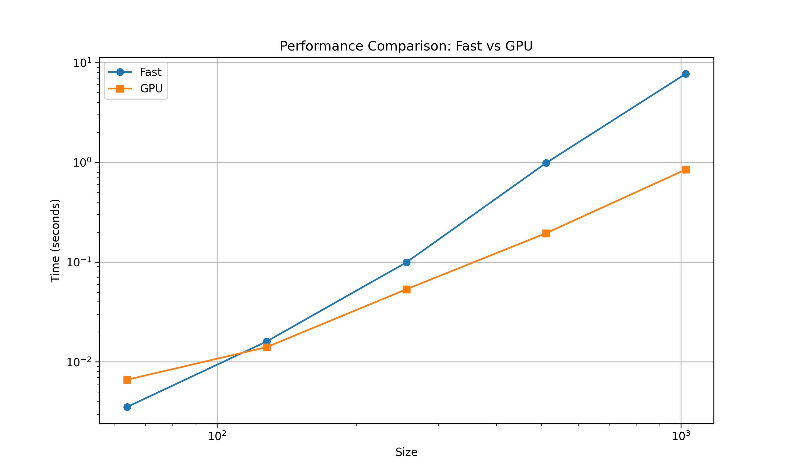

# MiniTorch Module 3


* Docs: https://minitorch.github.io/

* Overview: https://minitorch.github.io/module3.html


You will need to modify `tensor_functions.py` slightly in this assignment.

* Tests:

```
python run_tests.py
```

* Note:

Several of the tests for this assignment will only run if you are on a GPU machine and will not
run on github's test infrastructure. Please follow the instructions to setup up a colab machine
to run these tests.

This assignment requires the following files from the previous assignments. You can get these by running

```bash
python sync_previous_module.py previous-module-dir current-module-dir
```

The files that will be synced are:

        minitorch/tensor_data.py minitorch/tensor_functions.py minitorch/tensor_ops.py minitorch/operators.py minitorch/scalar.py minitorch/scalar_functions.py minitorch/module.py minitorch/autodiff.py minitorch/module.py project/run_manual.py project/run_scalar.py project/run_tensor.py minitorch/operators.py minitorch/module.py minitorch/autodiff.py minitorch/tensor.py minitorch/datasets.py minitorch/testing.py minitorch/optim.py


# Task3_1 and Task3_2
output from running `(.venv) andromeda@Alexs-Mac-mini mod3-ohorban % python3 project/parallel_check.py`:

```
MAP

================================================================================
 Parallel Accelerator Optimizing:  Function tensor_map.<locals>._map,
/Users/andromeda/Desktop/mod3-ohorban/minitorch/fast_ops.py (160)
================================================================================


Parallel loop listing for  Function tensor_map.<locals>._map, /Users/andromeda/Desktop/mod3-ohorban/minitorch/fast_ops.py (160)
------------------------------------------------------------------------------------------------------|loop #ID
    def _map(                                                                                         |
        out: Storage,  # Output tensor storage.                                                       |
        out_shape: Shape,  # Shape of the output tensor.                                              |
        out_strides: Strides,  # Strides for output tensor indexing.                                  |
        in_storage: Storage,  # Input tensor storage.                                                 |
        in_shape: Shape,  # Shape of the input tensor.                                                |
        in_strides: Strides,  # Strides for input tensor indexing.                                    |
    ) -> None:                                                                                        |
        """Apply the function `fn` to each element of the input tensor and store in the output."""    |
        N = len(out)  # Total number of elements in the output tensor.                                |
                                                                                                      |
        # Check if the output and input tensors have the same shape.                                  |
        same_shape = len(out_shape) == len(in_shape) and np.all(out_shape == in_shape)----------------| #0
                                                                                                      |
        # Check if the output and input tensors have the same strides.                                |
        same_strides = len(out_strides) == len(in_strides) and np.all(                                |
            out_strides == in_strides-----------------------------------------------------------------| #1
        )                                                                                             |
                                                                                                      |
        if same_shape and same_strides:                                                               |
            # If shapes and strides are the same, we can directly apply the function element-wise.    |
            for i in prange(N):  # Iterate in parallel over all elements.-----------------------------| #4
                # Apply the function `fn` to the corresponding elements without index computation.    |
                out[i] = fn(in_storage[i])                                                            |
        else:                                                                                         |
            # Otherwise, compute indices for broadcasting and use strides for indexing.               |
            for i in prange(N):  # Iterate in parallel over all elements.-----------------------------| #5
                # Temporary arrays to hold indices for input and output tensors.                      |
                out_index = np.zeros(len(out_shape), dtype=np.int32)----------------------------------| #2
                in_index = np.zeros(len(in_shape), dtype=np.int32)------------------------------------| #3
                                                                                                      |
                # Convert linear index `i` to multidimensional index for the output tensor.           |
                to_index(i, out_shape, out_index)                                                     |
                                                                                                      |
                # Broadcast the output index to match the input tensor shape.                         |
                broadcast_index(out_index, out_shape, in_shape, in_index)                             |
                                                                                                      |
                # Calculate the positions in storage using strides.                                   |
                out_pos = index_to_position(out_index, out_strides)                                   |
                in_pos = index_to_position(in_index, in_strides)                                      |
                                                                                                      |
                # Access the corresponding element in the input tensor.                               |
                x = in_storage[in_pos]                                                                |
                                                                                                      |
                # Apply the function `fn` and store the result in the output tensor.                  |
                out[out_pos] = fn(x)                                                                  |
--------------------------------- Fusing loops ---------------------------------
Attempting fusion of parallel loops (combines loops with similar properties)...
Following the attempted fusion of parallel for-loops there are 6 parallel for-
loop(s) (originating from loops labelled: #0, #1, #4, #5, #2, #3).
--------------------------------------------------------------------------------
---------------------------- Optimising loop nests -----------------------------
Attempting loop nest rewrites (optimising for the largest parallel loops)...

+--5 is a parallel loop
   +--2 --> rewritten as a serial loop
   +--3 --> rewritten as a serial loop
--------------------------------------------------------------------------------
----------------------------- Before Optimisation ------------------------------
Parallel region 0:
+--5 (parallel)
   +--2 (parallel)
   +--3 (parallel)


--------------------------------------------------------------------------------
------------------------------ After Optimisation ------------------------------
Parallel region 0:
+--5 (parallel)
   +--2 (serial)
   +--3 (serial)


Parallel region 0 (loop #5) had 0 loop(s) fused and 2 loop(s) serialized as part
 of the larger parallel loop (#5).
--------------------------------------------------------------------------------
--------------------------------------------------------------------------------

---------------------------Loop invariant code motion---------------------------
Allocation hoisting:
The memory allocation derived from the instruction at
/Users/andromeda/Desktop/mod3-ohorban/minitorch/fast_ops.py (188) is hoisted out
 of the parallel loop labelled #5 (it will be performed before the loop is
executed and reused inside the loop):
   Allocation:: out_index = np.zeros(len(out_shape), dtype=np.int32)
    - numpy.empty() is used for the allocation.
The memory allocation derived from the instruction at
/Users/andromeda/Desktop/mod3-ohorban/minitorch/fast_ops.py (189) is hoisted out
 of the parallel loop labelled #5 (it will be performed before the loop is
executed and reused inside the loop):
   Allocation:: in_index = np.zeros(len(in_shape), dtype=np.int32)
    - numpy.empty() is used for the allocation.
None
ZIP

================================================================================
 Parallel Accelerator Optimizing:  Function tensor_zip.<locals>._zip,
/Users/andromeda/Desktop/mod3-ohorban/minitorch/fast_ops.py (235)
================================================================================


Parallel loop listing for  Function tensor_zip.<locals>._zip, /Users/andromeda/Desktop/mod3-ohorban/minitorch/fast_ops.py (235)
---------------------------------------------------------------------------------------------------------|loop #ID
    def _zip(                                                                                            |
        out: Storage,  # Output tensor storage.                                                          |
        out_shape: Shape,  # Shape of the output tensor.                                                 |
        out_strides: Strides,  # Strides for output tensor indexing.                                     |
        a_storage: Storage,  # Storage for the first input tensor.                                       |
        a_shape: Shape,  # Shape of the first input tensor.                                              |
        a_strides: Strides,  # Strides for the first input tensor.                                       |
        b_storage: Storage,  # Storage for the second input tensor.                                      |
        b_shape: Shape,  # Shape of the second input tensor.                                             |
        b_strides: Strides,  # Strides for the second input tensor.                                      |
    ) -> None:                                                                                           |
        """Apply the binary function `fn` to elements from two tensors."""                               |
        N = len(out)  # Total number of elements in the output tensor.                                   |
                                                                                                         |
        # Check if the output and input tensors have the same shape.                                     |
        same_shape = (                                                                                   |
            len(out_shape) == len(a_shape) == len(b_shape)                                               |
            and np.all(out_shape == a_shape)-------------------------------------------------------------| #6
            and np.all(out_shape == b_shape)-------------------------------------------------------------| #7
        )                                                                                                |
                                                                                                         |
        # Check if the output and input tensors have the same strides.                                   |
        same_strides = (                                                                                 |
            len(out_strides) == len(a_strides) == len(b_strides)                                         |
            and np.all(out_strides == a_strides)---------------------------------------------------------| #8
            and np.all(out_strides == b_strides)---------------------------------------------------------| #9
        )                                                                                                |
                                                                                                         |
        if same_shape and same_strides:                                                                  |
            # If shapes and strides are the same, we can process directly without index computations.    |
            for i in prange(N):  # Parallel iteration over elements.-------------------------------------| #13
                # Apply the function `fn` directly to the corresponding elements.                        |
                out[i] = fn(a_storage[i], b_storage[i])                                                  |
        else:                                                                                            |
            # Otherwise, compute indices for broadcasting and use strides for indexing.                  |
            for i in prange(N):  # Parallel iteration over elements.-------------------------------------| #14
                # Temporary index arrays for output, and the two input tensors.                          |
                out_index = np.zeros(len(out_shape), dtype=np.int32)-------------------------------------| #10
                a_in = np.zeros(len(a_shape), dtype=np.int32)--------------------------------------------| #11
                b_in = np.zeros(len(b_shape), dtype=np.int32)--------------------------------------------| #12
                                                                                                         |
                # Convert linear index `i` to multidimensional indices for the output tensor.            |
                to_index(i, out_shape, out_index)                                                        |
                                                                                                         |
                # Map the output indices to positions in the input tensors via broadcasting.             |
                broadcast_index(out_index, out_shape, a_shape, a_in)                                     |
                broadcast_index(out_index, out_shape, b_shape, b_in)                                     |
                                                                                                         |
                # Calculate positions in storage using strides.                                          |
                out_pos = index_to_position(out_index, out_strides)                                      |
                a_pos = index_to_position(a_in, a_strides)                                               |
                b_pos = index_to_position(b_in, b_strides)                                               |
                                                                                                         |
                # Access elements in the input tensors.                                                  |
                a = a_storage[a_pos]                                                                     |
                b = b_storage[b_pos]                                                                     |
                                                                                                         |
                # Apply the function `fn` and store the result in the output tensor.                     |
                out[out_pos] = fn(a, b)                                                                  |
--------------------------------- Fusing loops ---------------------------------
Attempting fusion of parallel loops (combines loops with similar properties)...
Following the attempted fusion of parallel for-loops there are 9 parallel for-
loop(s) (originating from loops labelled: #6, #7, #8, #9, #13, #14, #10, #11,
#12).
--------------------------------------------------------------------------------
---------------------------- Optimising loop nests -----------------------------
Attempting loop nest rewrites (optimising for the largest parallel loops)...

+--14 is a parallel loop
   +--10 --> rewritten as a serial loop
   +--11 --> rewritten as a serial loop
   +--12 --> rewritten as a serial loop
--------------------------------------------------------------------------------
----------------------------- Before Optimisation ------------------------------
Parallel region 0:
+--14 (parallel)
   +--10 (parallel)
   +--11 (parallel)
   +--12 (parallel)


--------------------------------------------------------------------------------
------------------------------ After Optimisation ------------------------------
Parallel region 0:
+--14 (parallel)
   +--10 (serial)
   +--11 (serial)
   +--12 (serial)


Parallel region 0 (loop #14) had 0 loop(s) fused and 3 loop(s) serialized as
part of the larger parallel loop (#14).
--------------------------------------------------------------------------------
--------------------------------------------------------------------------------

---------------------------Loop invariant code motion---------------------------
Allocation hoisting:
The memory allocation derived from the instruction at
/Users/andromeda/Desktop/mod3-ohorban/minitorch/fast_ops.py (272) is hoisted out
 of the parallel loop labelled #14 (it will be performed before the loop is
executed and reused inside the loop):
   Allocation:: out_index = np.zeros(len(out_shape), dtype=np.int32)
    - numpy.empty() is used for the allocation.
The memory allocation derived from the instruction at
/Users/andromeda/Desktop/mod3-ohorban/minitorch/fast_ops.py (273) is hoisted out
 of the parallel loop labelled #14 (it will be performed before the loop is
executed and reused inside the loop):
   Allocation:: a_in = np.zeros(len(a_shape), dtype=np.int32)
    - numpy.empty() is used for the allocation.
The memory allocation derived from the instruction at
/Users/andromeda/Desktop/mod3-ohorban/minitorch/fast_ops.py (274) is hoisted out
 of the parallel loop labelled #14 (it will be performed before the loop is
executed and reused inside the loop):
   Allocation:: b_in = np.zeros(len(b_shape), dtype=np.int32)
    - numpy.empty() is used for the allocation.
None
REDUCE

================================================================================
 Parallel Accelerator Optimizing:  Function tensor_reduce.<locals>._reduce,
/Users/andromeda/Desktop/mod3-ohorban/minitorch/fast_ops.py (321)
================================================================================


Parallel loop listing for  Function tensor_reduce.<locals>._reduce, /Users/andromeda/Desktop/mod3-ohorban/minitorch/fast_ops.py (321)
-------------------------------------------------------------------------------------------|loop #ID
    def _reduce(                                                                           |
        out: Storage,  # Output tensor storage.                                            |
        out_shape: Shape,  # Shape of the output tensor.                                   |
        out_strides: Strides,  # Strides for output tensor indexing.                       |
        a_storage: Storage,  # Input tensor storage.                                       |
        a_shape: Shape,  # Shape of the input tensor.                                      |
        a_strides: Strides,  # Strides for input tensor indexing.                          |
        reduce_dim: int,  # Dimension along which reduction is performed.                  |
    ) -> None:                                                                             |
        """Perform reduction along the specified dimension."""                             |
        N = len(out)  # Total number of elements in the output tensor.                     |
                                                                                           |
        reduce_size = a_shape[reduce_dim]  # Size of the dimension being reduced.          |
                                                                                           |
        for i in prange(N):  # Parallel iteration over output elements.--------------------| #16
            # Temporary array for indexing the output tensor.                              |
            out_index = np.zeros(len(out_shape), dtype=np.int32)---------------------------| #15
                                                                                           |
            # Convert linear index `i` to multidimensional index for the output tensor.    |
            to_index(i, out_shape, out_index)                                              |
                                                                                           |
            # Calculate the position in the output tensor storage.                         |
            out_pos = index_to_position(out_index, out_strides)                            |
                                                                                           |
            # Initialize the accumulator with the initial value from the output tensor.    |
            accum = out[out_pos]                                                           |
                                                                                           |
            # Calculate the starting position in the input tensor storage.                 |
            a_pos = index_to_position(out_index, a_strides)                                |
                                                                                           |
            # Compute the step size in the input storage for the reduction dimension.      |
            step = a_strides[reduce_dim]                                                   |
                                                                                           |
            # Iterate over the reduction dimension.                                        |
            for s in range(reduce_size):                                                   |
                # Update the accumulator with the value from the input tensor.             |
                accum = fn(accum, a_storage[a_pos])                                        |
                                                                                           |
                # Move to the next element along the reduction dimension.                  |
                a_pos += step                                                              |
                                                                                           |
            # Store the result of the reduction in the output tensor.                      |
            out[out_pos] = accum                                                           |
--------------------------------- Fusing loops ---------------------------------
Attempting fusion of parallel loops (combines loops with similar properties)...
Following the attempted fusion of parallel for-loops there are 2 parallel for-
loop(s) (originating from loops labelled: #16, #15).
--------------------------------------------------------------------------------
---------------------------- Optimising loop nests -----------------------------
Attempting loop nest rewrites (optimising for the largest parallel loops)...

+--16 is a parallel loop
   +--15 --> rewritten as a serial loop
--------------------------------------------------------------------------------
----------------------------- Before Optimisation ------------------------------
Parallel region 0:
+--16 (parallel)
   +--15 (parallel)


--------------------------------------------------------------------------------
------------------------------ After Optimisation ------------------------------
Parallel region 0:
+--16 (parallel)
   +--15 (serial)


Parallel region 0 (loop #16) had 0 loop(s) fused and 1 loop(s) serialized as
part of the larger parallel loop (#16).
--------------------------------------------------------------------------------
--------------------------------------------------------------------------------

---------------------------Loop invariant code motion---------------------------
Allocation hoisting:
The memory allocation derived from the instruction at
/Users/andromeda/Desktop/mod3-ohorban/minitorch/fast_ops.py (337) is hoisted out
 of the parallel loop labelled #16 (it will be performed before the loop is
executed and reused inside the loop):
   Allocation:: out_index = np.zeros(len(out_shape), dtype=np.int32)
    - numpy.empty() is used for the allocation.
None
MATRIX MULTIPLY

================================================================================
 Parallel Accelerator Optimizing:  Function _tensor_matrix_multiply,
/Users/andromeda/Desktop/mod3-ohorban/minitorch/fast_ops.py (370)
================================================================================


Parallel loop listing for  Function _tensor_matrix_multiply, /Users/andromeda/Desktop/mod3-ohorban/minitorch/fast_ops.py (370)
---------------------------------------------------------------------------------------------|loop #ID
def _tensor_matrix_multiply(                                                                 |
    out: Storage,                                                                            |
    out_shape: Shape,                                                                        |
    out_strides: Strides,                                                                    |
    a_storage: Storage,                                                                      |
    a_shape: Shape,                                                                          |
    a_strides: Strides,                                                                      |
    b_storage: Storage,                                                                      |
    b_shape: Shape,                                                                          |
    b_strides: Strides,                                                                      |
) -> None:                                                                                   |
    """NUMBA tensor matrix multiply function.                                                |
                                                                                             |
    Should work for any tensor shapes that broadcast as long as                              |
                                                                                             |
        assert a_shape[-1] == b_shape[-2]                                                    |
                                                                                             |
    Optimizations:                                                                           |
                                                                                             |
    * Outer loop in parallel                                                                 |
    * No index buffers or function calls                                                     |
    * Inner loop should have no global writes, 1 multiply.                                   |
                                                                                             |
    Args:                                                                                    |
    ----                                                                                     |
        out (Storage): Storage for the output tensor.                                        |
        out_shape (Shape): Shape of the output tensor.                                       |
        out_strides (Strides): Strides for the output tensor.                                |
        a_storage (Storage): Storage for tensor `a`.                                         |
        a_shape (Shape): Shape of tensor `a`.                                                |
        a_strides (Strides): Strides for tensor `a`.                                         |
        b_storage (Storage): Storage for tensor `b`.                                         |
        b_shape (Shape): Shape of tensor `b`.                                                |
        b_strides (Strides): Strides for tensor `b`.                                         |
                                                                                             |
    Returns:                                                                                 |
    -------                                                                                  |
        None: Fills in `out` with the result of matrix multiplication.                       |
                                                                                             |
    """                                                                                      |
    # Extract batch strides.                                                                 |
    a_batch_stride = a_strides[0] if a_shape[0] > 1 else 0                                   |
    b_batch_stride = b_strides[0] if b_shape[0] > 1 else 0                                   |
    # Calculate batch stride offsets only if the batch dimension > 1.                        |
    # If batch size is 1, the tensors are not batched, so the stride is 0.                   |
                                                                                             |
    assert a_shape[-1] == b_shape[-2]                                                        |
    # Ensure that the inner dimensions of the matrices are compatible for multiplication:    |
    # The number of columns in `a` must equal the number of rows in `b`.                     |
                                                                                             |
    # Extract dimensions for readability.                                                    |
    batch_size, out_dim1, out_dim2 = out_shape[0], out_shape[1], out_shape[2]                |
    # Precompute strides for efficiency.                                                     |
    out_stride0, out_stride1, out_stride2 = (                                                |
        out_strides[0],                                                                      |
        out_strides[1],                                                                      |
        out_strides[2],                                                                      |
    )                                                                                        |
    a_stride1, a_stride2 = a_strides[1], a_strides[2]                                        |
    b_stride1, b_stride2 = b_strides[1], b_strides[2]                                        |
                                                                                             |
    # Iterate over the batch dimension in parallel.                                          |
    for batch in prange(batch_size):---------------------------------------------------------| #17
        for i in range(out_dim1):  # Iterate over the rows of the output matrix.             |
            for j in range(out_dim2):  # Iterate over the columns of the output matrix.      |
                # Compute starting positions in the input tensors `a` and `b`.               |
                a_start = batch * a_batch_stride + i * a_stride1                             |
                b_start = batch * b_batch_stride + j * b_stride2                             |
                                                                                             |
                # Initialize accumulator for the dot product.                                |
                temp = 0.0                                                                   |
                                                                                             |
                # Perform the dot product over the shared dimension.                         |
                for k in range(a_shape[2]):                                                  |
                    # Calculate positions in `a` and `b`.                                    |
                    a_pos = a_start + k * a_stride2  # Access element from `a`.              |
                    b_pos = b_start + k * b_stride1  # Access element from `b`.              |
                                                                                             |
                    # Multiply and accumulate the corresponding elements.                    |
                    temp += a_storage[a_pos] * b_storage[b_pos]                              |
                                                                                             |
                # Compute the position in the output storage.                                |
                out_pos = batch * out_stride0 + i * out_stride1 + j * out_stride2            |
                                                                                             |
                # Store the result of the dot product in the output tensor.                  |
                out[out_pos] = temp                                                          |
--------------------------------- Fusing loops ---------------------------------
Attempting fusion of parallel loops (combines loops with similar properties)...
Following the attempted fusion of parallel for-loops there are 1 parallel for-
loop(s) (originating from loops labelled: #17).
--------------------------------------------------------------------------------
----------------------------- Before Optimisation ------------------------------
--------------------------------------------------------------------------------
------------------------------ After Optimisation ------------------------------
Parallel structure is already optimal.
--------------------------------------------------------------------------------
--------------------------------------------------------------------------------

---------------------------Loop invariant code motion---------------------------
Allocation hoisting:
No allocation hoisting found
None
```

# Task3_3
Tests passing on google colab after running `!pytest -m task3_3`:
```
======================================= test session starts ========================================
platform linux -- Python 3.10.12, pytest-8.3.2, pluggy-1.5.0
rootdir: /content
plugins: hypothesis-6.54.0, env-1.1.4, typeguard-4.4.1, anyio-3.7.1
collected 117 items / 60 deselected / 57 selected

mod3-ohorban/tests/test_tensor_general.py .................................................. [ 87%]
.......                                                                                      [100%]
=================== 57 passed, 60 deselected, 4322 warnings in 244.33s (0:04:04) ===================
```


# Task3_4
Tests passing on google colab after running `!pytest -m task3_4`:

```
======================================= test session starts ========================================
platform linux -- Python 3.12.7, pytest-8.3.2, pluggy-1.5.0
rootdir: /content
plugins: hypothesis-6.54.0, env-1.1.4
collected 117 items / 110 deselected / 7 selected

mod3-ohorban/tests/test_tensor_general.py .......                                            [100%]
========================= 7 passed, 110 deselected, 154 warnings in 11.45s =========================
```


after running `!cd $DIR; python3 project/timing.py` in google colab:

```
/usr/local/lib/python3.10/dist-packages/numba/cuda/dispatcher.py:536: NumbaPerformanceWarning: Grid size 2 will likely result in GPU under-utilization due to low occupancy.
  warn(NumbaPerformanceWarning(msg))
/usr/local/lib/python3.10/dist-packages/numba/cuda/cudadrv/devicearray.py:888: NumbaPerformanceWarning: Host array used in CUDA kernel will incur copy overhead to/from device.
  warn(NumbaPerformanceWarning(msg))
Running size 64
/usr/local/lib/python3.10/dist-packages/numba/cuda/dispatcher.py:536: NumbaPerformanceWarning: Grid size 8 will likely result in GPU under-utilization due to low occupancy.
  warn(NumbaPerformanceWarning(msg))
{'fast': 0.0035250186920166016, 'gpu': 0.006620248158772786}
Running size 128
/usr/local/lib/python3.10/dist-packages/numba/cuda/dispatcher.py:536: NumbaPerformanceWarning: Grid size 32 will likely result in GPU under-utilization due to low occupancy.
  warn(NumbaPerformanceWarning(msg))
{'fast': 0.01604485511779785, 'gpu': 0.014055728912353516}
Running size 256
{'fast': 0.0994115670522054, 'gpu': 0.05345543225606283}
Running size 512
{'fast': 0.9861493905385336, 'gpu': 0.19518097241719565}
Running size 1024
{'fast': 7.728023211161296, 'gpu': 0.8481698830922445}

Timing summary
Size: 64
    fast: 0.00353
    gpu: 0.00662
Size: 128
    fast: 0.01604
    gpu: 0.01406
Size: 256
    fast: 0.09941
    gpu: 0.05346
Size: 512
    fast: 0.98615
    gpu: 0.19518
Size: 1024
    fast: 7.72802
    gpu: 0.84817
```



# Task3_5

### Time / Epoch Summary:
| Dataset        | Avg Time / Epoch (GPU) | Avg Time / Epoch (CPU) |
|----------------|-------------------------|-------------------------|
| Simple         | 1.8786 sec             | 0.3527 sec             |
| Split          | 1.8665 sec             | 0.3522 sec             |
| XOR            | 1.8276 sec             | 0.3539 sec             |


#### Simple

```
!cd $DIR; time PYTHONPATH=/content/$DIR python3.12 project/run_fast_tensor.py --BACKEND gpu --HIDDEN 200 --DATASET simple --RATE 0.05
```

```
Epoch 0 Loss: 2.4729 Correct: 45 Time: 4.2606 sec
Epoch 10 Loss: 0.4386 Correct: 50 Time: 1.8774 sec
Epoch 20 Loss: 0.3390 Correct: 50 Time: 1.7730 sec
Epoch 30 Loss: 0.3336 Correct: 50 Time: 1.7232 sec
Epoch 40 Loss: 0.8100 Correct: 50 Time: 1.7060 sec
Epoch 50 Loss: 0.3312 Correct: 50 Time: 1.7819 sec
Epoch 60 Loss: 0.1496 Correct: 50 Time: 1.6962 sec
Epoch 70 Loss: 0.6108 Correct: 50 Time: 1.7149 sec
Epoch 80 Loss: 0.0914 Correct: 50 Time: 1.7816 sec
Epoch 90 Loss: 1.1468 Correct: 49 Time: 1.7291 sec
Epoch 100 Loss: 0.1522 Correct: 50 Time: 1.6892 sec
Epoch 110 Loss: 0.3285 Correct: 50 Time: 1.7148 sec
Epoch 120 Loss: 0.1878 Correct: 50 Time: 1.6811 sec
Epoch 130 Loss: 0.3121 Correct: 50 Time: 1.7389 sec
Epoch 140 Loss: 0.2654 Correct: 50 Time: 1.6963 sec
Epoch 150 Loss: 0.0423 Correct: 50 Time: 1.7129 sec
Epoch 160 Loss: 0.2701 Correct: 50 Time: 1.9500 sec
Epoch 170 Loss: 0.1152 Correct: 50 Time: 1.7098 sec
Epoch 180 Loss: 0.1850 Correct: 50 Time: 2.2375 sec
Epoch 190 Loss: 0.2299 Correct: 50 Time: 1.6944 sec
Epoch 200 Loss: 0.0055 Correct: 50 Time: 2.5052 sec
Epoch 210 Loss: 0.2667 Correct: 50 Time: 1.7393 sec
Epoch 220 Loss: 0.0295 Correct: 50 Time: 2.2756 sec
Epoch 230 Loss: 0.0136 Correct: 50 Time: 1.8092 sec
Epoch 240 Loss: 0.1282 Correct: 50 Time: 2.5270 sec
Epoch 250 Loss: 0.0292 Correct: 50 Time: 1.7848 sec
Epoch 260 Loss: 0.1444 Correct: 50 Time: 2.6015 sec
Epoch 270 Loss: 0.1718 Correct: 50 Time: 1.7056 sec
Epoch 280 Loss: 0.0237 Correct: 50 Time: 2.5219 sec
Epoch 290 Loss: 0.1552 Correct: 50 Time: 1.7435 sec
Epoch 300 Loss: 0.0003 Correct: 50 Time: 2.2770 sec
Epoch 310 Loss: 0.1349 Correct: 50 Time: 1.6967 sec
Epoch 320 Loss: 0.2794 Correct: 50 Time: 1.9520 sec
Epoch 330 Loss: 0.0218 Correct: 50 Time: 1.7190 sec
Epoch 340 Loss: 0.1176 Correct: 50 Time: 1.7185 sec
Epoch 350 Loss: 0.2080 Correct: 50 Time: 1.7368 sec
Epoch 360 Loss: 0.0011 Correct: 50 Time: 2.1451 sec
Epoch 370 Loss: 0.0561 Correct: 50 Time: 1.8013 sec
Epoch 380 Loss: 0.0063 Correct: 50 Time: 2.2048 sec
Epoch 390 Loss: 0.0108 Correct: 50 Time: 1.7429 sec
Epoch 400 Loss: 0.0001 Correct: 50 Time: 2.1048 sec
Epoch 410 Loss: 0.0075 Correct: 50 Time: 1.7375 sec
Epoch 420 Loss: 0.0149 Correct: 50 Time: 1.9595 sec
Epoch 430 Loss: 0.0000 Correct: 50 Time: 1.7427 sec
Epoch 440 Loss: 0.0186 Correct: 50 Time: 1.6870 sec
Epoch 450 Loss: 0.0041 Correct: 50 Time: 1.6773 sec
Epoch 460 Loss: 0.0328 Correct: 50 Time: 1.6678 sec
Epoch 470 Loss: 0.0148 Correct: 50 Time: 1.6839 sec
Epoch 480 Loss: 0.0007 Correct: 50 Time: 1.6867 sec
Epoch 490 Loss: 0.0980 Correct: 50 Time: 1.6844 sec

Avg Time / Epoch: 1.8786 sec

real	15m46.270s
user	15m32.720s
sys	0m6.277s
```

```
!cd $DIR; time PYTHONPATH=/content/$DIR python3.12 project/run_fast_tensor.py --BACKEND cpu --HIDDEN 200 --DATASET simple --RATE 0.05
```

```
Epoch 0 Loss: 14.0035 Correct: 30 Time: 22.1432 sec
Epoch 10 Loss: 0.5325 Correct: 48 Time: 0.4083 sec
Epoch 20 Loss: 0.8184 Correct: 49 Time: 0.2822 sec
Epoch 30 Loss: 0.0185 Correct: 50 Time: 0.2674 sec
Epoch 40 Loss: 0.6362 Correct: 49 Time: 0.2681 sec
Epoch 50 Loss: 1.3919 Correct: 50 Time: 0.5515 sec
Epoch 60 Loss: 0.1063 Correct: 50 Time: 0.2694 sec
Epoch 70 Loss: 0.2329 Correct: 49 Time: 0.2678 sec
Epoch 80 Loss: 1.3348 Correct: 50 Time: 0.2646 sec
Epoch 90 Loss: 0.0064 Correct: 50 Time: 0.5521 sec
Epoch 100 Loss: 0.0906 Correct: 50 Time: 0.2686 sec
Epoch 110 Loss: 0.5378 Correct: 49 Time: 0.2694 sec
Epoch 120 Loss: 0.0365 Correct: 49 Time: 0.2810 sec
Epoch 130 Loss: 0.5415 Correct: 49 Time: 0.5863 sec
Epoch 140 Loss: 0.1812 Correct: 49 Time: 0.2699 sec
Epoch 150 Loss: 0.0027 Correct: 49 Time: 0.2790 sec
Epoch 160 Loss: 0.3432 Correct: 49 Time: 0.2781 sec
Epoch 170 Loss: 0.7280 Correct: 49 Time: 0.5635 sec
Epoch 180 Loss: 0.1408 Correct: 50 Time: 0.5427 sec
Epoch 190 Loss: 0.0464 Correct: 50 Time: 0.2764 sec
Epoch 200 Loss: 0.3897 Correct: 50 Time: 0.2703 sec
Epoch 210 Loss: 0.0476 Correct: 50 Time: 0.2705 sec
Epoch 220 Loss: 0.9917 Correct: 50 Time: 0.2724 sec
Epoch 230 Loss: 0.0367 Correct: 50 Time: 0.2767 sec
Epoch 240 Loss: 1.0406 Correct: 50 Time: 0.2684 sec
Epoch 250 Loss: 0.0166 Correct: 49 Time: 0.3716 sec
Epoch 260 Loss: 0.0487 Correct: 50 Time: 0.2763 sec
Epoch 270 Loss: 0.0767 Correct: 49 Time: 0.2797 sec
Epoch 280 Loss: 0.7296 Correct: 50 Time: 0.2664 sec
Epoch 290 Loss: 0.2541 Correct: 50 Time: 0.5906 sec
Epoch 300 Loss: 0.6802 Correct: 50 Time: 0.2825 sec
Epoch 310 Loss: 0.2051 Correct: 50 Time: 0.2743 sec
Epoch 320 Loss: 0.1867 Correct: 50 Time: 0.2777 sec
Epoch 330 Loss: 0.3176 Correct: 50 Time: 0.5928 sec
Epoch 340 Loss: 0.0002 Correct: 50 Time: 0.2899 sec
Epoch 350 Loss: 0.0696 Correct: 50 Time: 0.2679 sec
Epoch 360 Loss: 0.0305 Correct: 50 Time: 0.2713 sec
Epoch 370 Loss: 0.0486 Correct: 50 Time: 0.6134 sec
Epoch 380 Loss: 0.4205 Correct: 50 Time: 0.2836 sec
Epoch 390 Loss: 0.1846 Correct: 50 Time: 0.2792 sec
Epoch 400 Loss: 0.0634 Correct: 50 Time: 0.2759 sec
Epoch 410 Loss: 0.0002 Correct: 50 Time: 0.6186 sec
Epoch 420 Loss: 0.2995 Correct: 50 Time: 0.2762 sec
Epoch 430 Loss: 0.0665 Correct: 50 Time: 0.2815 sec
Epoch 440 Loss: 0.4772 Correct: 50 Time: 0.2682 sec
Epoch 450 Loss: 0.4639 Correct: 50 Time: 0.5685 sec
Epoch 460 Loss: 0.5618 Correct: 50 Time: 0.2727 sec
Epoch 470 Loss: 0.4668 Correct: 50 Time: 0.2866 sec
Epoch 480 Loss: 0.1284 Correct: 50 Time: 0.2708 sec
Epoch 490 Loss: 0.0516 Correct: 50 Time: 0.5389 sec

Avg Time / Epoch: 0.3527 sec

real	3m8.549s
user	3m29.295s
sys	0m34.557s
```


#### Split

```
!cd $DIR; time PYTHONPATH=/content/$DIR python3.12 project/run_fast_tensor.py --BACKEND gpu --HIDDEN 200 --DATASET split --RATE 0.05
```

```
Epoch 0 Loss: 9.1276 Correct: 32 Time: 3.6979 sec
Epoch 10 Loss: 3.4163 Correct: 46 Time: 1.7828 sec
Epoch 20 Loss: 2.0969 Correct: 46 Time: 1.8123 sec
Epoch 30 Loss: 2.2317 Correct: 46 Time: 1.7368 sec
Epoch 40 Loss: 2.3831 Correct: 47 Time: 1.7374 sec
Epoch 50 Loss: 2.1280 Correct: 49 Time: 1.8011 sec
Epoch 60 Loss: 1.1637 Correct: 46 Time: 1.7155 sec
Epoch 70 Loss: 0.9756 Correct: 47 Time: 1.7467 sec
Epoch 80 Loss: 0.8878 Correct: 49 Time: 1.8260 sec
Epoch 90 Loss: 0.7487 Correct: 49 Time: 1.7575 sec
Epoch 100 Loss: 1.0976 Correct: 49 Time: 1.7317 sec
Epoch 110 Loss: 0.8540 Correct: 48 Time: 1.7253 sec
Epoch 120 Loss: 1.8816 Correct: 49 Time: 1.7413 sec
Epoch 130 Loss: 1.4396 Correct: 50 Time: 1.7464 sec
Epoch 140 Loss: 0.1273 Correct: 47 Time: 1.7302 sec
Epoch 150 Loss: 1.7882 Correct: 47 Time: 1.7650 sec
Epoch 160 Loss: 2.5932 Correct: 45 Time: 1.8512 sec
Epoch 170 Loss: 1.3156 Correct: 50 Time: 1.7339 sec
Epoch 180 Loss: 0.9614 Correct: 47 Time: 1.8995 sec
Epoch 190 Loss: 1.1029 Correct: 50 Time: 1.7221 sec
Epoch 200 Loss: 0.9267 Correct: 49 Time: 1.9870 sec
Epoch 210 Loss: 0.7685 Correct: 50 Time: 1.7805 sec
Epoch 220 Loss: 1.5777 Correct: 49 Time: 2.0553 sec
Epoch 230 Loss: 1.2843 Correct: 49 Time: 1.7355 sec
Epoch 240 Loss: 0.8064 Correct: 49 Time: 2.5399 sec
Epoch 250 Loss: 0.7656 Correct: 50 Time: 1.7197 sec
Epoch 260 Loss: 0.3949 Correct: 49 Time: 2.3178 sec
Epoch 270 Loss: 0.8267 Correct: 48 Time: 1.6661 sec
Epoch 280 Loss: 2.6076 Correct: 46 Time: 2.2971 sec
Epoch 290 Loss: 0.2120 Correct: 49 Time: 1.6899 sec
Epoch 300 Loss: 2.0461 Correct: 46 Time: 2.1695 sec
Epoch 310 Loss: 1.6139 Correct: 50 Time: 1.7044 sec
Epoch 320 Loss: 0.5262 Correct: 50 Time: 2.2265 sec
Epoch 330 Loss: 1.0041 Correct: 50 Time: 1.7093 sec
Epoch 340 Loss: 0.8105 Correct: 50 Time: 2.0493 sec
Epoch 350 Loss: 0.4042 Correct: 50 Time: 2.2024 sec
Epoch 360 Loss: 0.3189 Correct: 50 Time: 2.4618 sec
Epoch 370 Loss: 0.0063 Correct: 49 Time: 1.7016 sec
Epoch 380 Loss: 0.6421 Correct: 50 Time: 2.5007 sec
Epoch 390 Loss: 0.5443 Correct: 50 Time: 1.7237 sec
Epoch 400 Loss: 1.8574 Correct: 47 Time: 2.4590 sec
Epoch 410 Loss: 0.8342 Correct: 49 Time: 1.7455 sec
Epoch 420 Loss: 2.2531 Correct: 49 Time: 2.3021 sec
Epoch 430 Loss: 0.3534 Correct: 50 Time: 1.7292 sec
Epoch 440 Loss: 0.1817 Correct: 49 Time: 2.1193 sec
Epoch 450 Loss: 1.5547 Correct: 47 Time: 1.7177 sec
Epoch 460 Loss: 0.2560 Correct: 50 Time: 2.2418 sec
Epoch 470 Loss: 0.4010 Correct: 50 Time: 1.7088 sec
Epoch 480 Loss: 0.1891 Correct: 49 Time: 1.9640 sec
Epoch 490 Loss: 1.0444 Correct: 48 Time: 1.6963 sec

Avg Time / Epoch: 1.8665 sec

real	15m39.985s
user	15m27.770s
sys	0m6.064s
```

```
!cd $DIR; time PYTHONPATH=/content/$DIR python3.12 project/run_fast_tensor.py --BACKEND cpu --HIDDEN 200 --DATASET split --RATE 0.05
```

```
Epoch 0 Loss: 8.6122 Correct: 25 Time: 22.2216 sec
Epoch 10 Loss: 5.2156 Correct: 34 Time: 0.2720 sec
Epoch 20 Loss: 4.4823 Correct: 45 Time: 0.2693 sec
Epoch 30 Loss: 2.3190 Correct: 49 Time: 0.2713 sec
Epoch 40 Loss: 2.1452 Correct: 48 Time: 0.5936 sec
Epoch 50 Loss: 2.3558 Correct: 47 Time: 0.2761 sec
Epoch 60 Loss: 2.7838 Correct: 49 Time: 0.2709 sec
Epoch 70 Loss: 2.0792 Correct: 50 Time: 0.2719 sec
Epoch 80 Loss: 2.7708 Correct: 49 Time: 0.5826 sec
Epoch 90 Loss: 0.6028 Correct: 47 Time: 0.2682 sec
Epoch 100 Loss: 0.8094 Correct: 49 Time: 0.2722 sec
Epoch 110 Loss: 1.0279 Correct: 48 Time: 0.2804 sec
Epoch 120 Loss: 1.7884 Correct: 49 Time: 0.5844 sec
Epoch 130 Loss: 1.2779 Correct: 48 Time: 0.2804 sec
Epoch 140 Loss: 0.9613 Correct: 47 Time: 0.2674 sec
Epoch 150 Loss: 0.8210 Correct: 50 Time: 0.2671 sec
Epoch 160 Loss: 1.7040 Correct: 48 Time: 0.5613 sec
Epoch 170 Loss: 1.4552 Correct: 48 Time: 0.2782 sec
Epoch 180 Loss: 0.4797 Correct: 49 Time: 0.2698 sec
Epoch 190 Loss: 1.5527 Correct: 48 Time: 0.2843 sec
Epoch 200 Loss: 1.1831 Correct: 49 Time: 0.6381 sec
Epoch 210 Loss: 0.9169 Correct: 50 Time: 0.2705 sec
Epoch 220 Loss: 0.8309 Correct: 48 Time: 0.2711 sec
Epoch 230 Loss: 0.3610 Correct: 49 Time: 0.2864 sec
Epoch 240 Loss: 1.5605 Correct: 49 Time: 0.5214 sec
Epoch 250 Loss: 1.4982 Correct: 49 Time: 0.2740 sec
Epoch 260 Loss: 0.1031 Correct: 49 Time: 0.2701 sec
Epoch 270 Loss: 0.7273 Correct: 50 Time: 0.2841 sec
Epoch 280 Loss: 0.0667 Correct: 50 Time: 0.4596 sec
Epoch 290 Loss: 0.7449 Correct: 50 Time: 0.2705 sec
Epoch 300 Loss: 2.0226 Correct: 48 Time: 0.2703 sec
Epoch 310 Loss: 0.3005 Correct: 50 Time: 0.2964 sec
Epoch 320 Loss: 0.0619 Correct: 50 Time: 0.4199 sec
Epoch 330 Loss: 0.8624 Correct: 50 Time: 0.2677 sec
Epoch 340 Loss: 0.5519 Correct: 50 Time: 0.2686 sec
Epoch 350 Loss: 1.4831 Correct: 50 Time: 0.2863 sec
Epoch 360 Loss: 0.4932 Correct: 50 Time: 0.4050 sec
Epoch 370 Loss: 0.1938 Correct: 50 Time: 0.2719 sec
Epoch 380 Loss: 1.1656 Correct: 50 Time: 0.2725 sec
Epoch 390 Loss: 0.0364 Correct: 50 Time: 0.2826 sec
Epoch 400 Loss: 0.4252 Correct: 50 Time: 0.3310 sec
Epoch 410 Loss: 0.3627 Correct: 50 Time: 0.2706 sec
Epoch 420 Loss: 0.0474 Correct: 50 Time: 0.2744 sec
Epoch 430 Loss: 0.2444 Correct: 50 Time: 0.2852 sec
Epoch 440 Loss: 1.1712 Correct: 49 Time: 0.3028 sec
Epoch 450 Loss: 0.2936 Correct: 50 Time: 0.2697 sec
Epoch 460 Loss: 0.1982 Correct: 50 Time: 0.2779 sec
Epoch 470 Loss: 0.5706 Correct: 50 Time: 0.2728 sec
Epoch 480 Loss: 0.5747 Correct: 50 Time: 0.2714 sec
Epoch 490 Loss: 0.2132 Correct: 50 Time: 0.2693 sec

Avg Time / Epoch: 0.3522 sec

real	3m9.081s
user	3m31.313s
sys	0m33.459s
```

#### XOR

```
!cd $DIR; time PYTHONPATH=/content/$DIR python3.12 project/run_fast_tensor.py --BACKEND gpu --HIDDEN 200 --DATASET xor --RATE 0.05
```

```
Epoch 0 Loss: 25.0638 Correct: 25 Time: 4.0813 sec
Epoch 10 Loss: 4.2330 Correct: 33 Time: 2.3531 sec
Epoch 20 Loss: 4.6950 Correct: 38 Time: 1.7948 sec
Epoch 30 Loss: 1.3470 Correct: 45 Time: 2.1875 sec
Epoch 40 Loss: 2.3925 Correct: 45 Time: 1.6912 sec
Epoch 50 Loss: 2.1346 Correct: 46 Time: 2.0203 sec
Epoch 60 Loss: 3.8305 Correct: 46 Time: 1.6944 sec
Epoch 70 Loss: 2.5357 Correct: 48 Time: 1.7386 sec
Epoch 80 Loss: 1.1200 Correct: 48 Time: 1.7580 sec
Epoch 90 Loss: 2.1746 Correct: 47 Time: 1.6899 sec
Epoch 100 Loss: 2.4284 Correct: 47 Time: 2.0619 sec
Epoch 110 Loss: 1.1975 Correct: 47 Time: 1.6765 sec
Epoch 120 Loss: 1.2286 Correct: 50 Time: 1.6676 sec
Epoch 130 Loss: 1.8936 Correct: 47 Time: 1.6888 sec
Epoch 140 Loss: 1.3652 Correct: 50 Time: 1.6817 sec
Epoch 150 Loss: 0.8379 Correct: 47 Time: 1.7235 sec
Epoch 160 Loss: 0.4969 Correct: 50 Time: 1.7383 sec
Epoch 170 Loss: 1.3351 Correct: 49 Time: 1.6690 sec
Epoch 180 Loss: 0.7290 Correct: 48 Time: 1.6521 sec
Epoch 190 Loss: 0.5427 Correct: 50 Time: 1.6724 sec
Epoch 200 Loss: 0.6676 Correct: 50 Time: 1.8938 sec
Epoch 210 Loss: 0.6276 Correct: 50 Time: 1.6639 sec
Epoch 220 Loss: 0.2143 Correct: 50 Time: 2.2023 sec
Epoch 230 Loss: 0.1854 Correct: 50 Time: 1.6965 sec
Epoch 240 Loss: 0.3889 Correct: 50 Time: 2.1682 sec
Epoch 250 Loss: 0.3672 Correct: 49 Time: 1.6501 sec
Epoch 260 Loss: 0.5245 Correct: 50 Time: 2.4576 sec
Epoch 270 Loss: 0.7833 Correct: 50 Time: 1.6781 sec
Epoch 280 Loss: 1.1539 Correct: 49 Time: 2.2225 sec
Epoch 290 Loss: 0.8309 Correct: 50 Time: 1.7246 sec
Epoch 300 Loss: 0.4597 Correct: 50 Time: 2.0712 sec
Epoch 310 Loss: 0.4083 Correct: 50 Time: 1.6736 sec
Epoch 320 Loss: 0.3787 Correct: 50 Time: 1.7197 sec
Epoch 330 Loss: 0.9888 Correct: 50 Time: 1.6755 sec
Epoch 340 Loss: 0.8818 Correct: 50 Time: 1.6817 sec
Epoch 350 Loss: 0.6629 Correct: 50 Time: 1.6855 sec
Epoch 360 Loss: 0.4776 Correct: 50 Time: 1.6917 sec
Epoch 370 Loss: 0.4518 Correct: 50 Time: 1.7110 sec
Epoch 380 Loss: 0.9346 Correct: 50 Time: 1.7474 sec
Epoch 390 Loss: 0.1976 Correct: 50 Time: 1.6693 sec
Epoch 400 Loss: 0.8244 Correct: 50 Time: 1.6566 sec
Epoch 410 Loss: 0.2366 Correct: 50 Time: 1.6629 sec
Epoch 420 Loss: 0.7807 Correct: 49 Time: 1.6578 sec
Epoch 430 Loss: 0.2891 Correct: 50 Time: 1.7758 sec
Epoch 440 Loss: 0.1791 Correct: 50 Time: 1.6818 sec
Epoch 450 Loss: 0.9249 Correct: 50 Time: 2.1297 sec
Epoch 460 Loss: 0.2918 Correct: 50 Time: 1.6484 sec
Epoch 470 Loss: 0.2503 Correct: 50 Time: 2.5034 sec
Epoch 480 Loss: 0.1991 Correct: 50 Time: 1.6657 sec
Epoch 490 Loss: 0.3488 Correct: 50 Time: 2.4595 sec

Avg Time / Epoch: 1.8276 sec

real	15m20.359s
user	15m8.663s
sys	0m5.996s
```

```
!cd $DIR; time PYTHONPATH=/content/$DIR python3.12 project/run_fast_tensor.py --BACKEND cpu --HIDDEN 200 --DATASET xor --RATE 0.05
```

```
Epoch 0 Loss: 4.9921 Correct: 39 Time: 21.5594 sec
Epoch 10 Loss: 1.8160 Correct: 44 Time: 0.2757 sec
Epoch 20 Loss: 2.2470 Correct: 45 Time: 0.2872 sec
Epoch 30 Loss: 2.4125 Correct: 46 Time: 0.2748 sec
Epoch 40 Loss: 2.7142 Correct: 48 Time: 0.2698 sec
Epoch 50 Loss: 1.4819 Correct: 47 Time: 0.2754 sec
Epoch 60 Loss: 2.4439 Correct: 48 Time: 0.2852 sec
Epoch 70 Loss: 1.2174 Correct: 43 Time: 0.2661 sec
Epoch 80 Loss: 5.0008 Correct: 37 Time: 0.2668 sec
Epoch 90 Loss: 2.9338 Correct: 48 Time: 0.2760 sec
Epoch 100 Loss: 1.5216 Correct: 46 Time: 0.2846 sec
Epoch 110 Loss: 2.3541 Correct: 48 Time: 0.2734 sec
Epoch 120 Loss: 2.2944 Correct: 46 Time: 0.2765 sec
Epoch 130 Loss: 2.4684 Correct: 49 Time: 0.2738 sec
Epoch 140 Loss: 3.0928 Correct: 49 Time: 0.2813 sec
Epoch 150 Loss: 1.2410 Correct: 47 Time: 0.2719 sec
Epoch 160 Loss: 2.4138 Correct: 49 Time: 0.2779 sec
Epoch 170 Loss: 0.5121 Correct: 47 Time: 0.2713 sec
Epoch 180 Loss: 2.0518 Correct: 49 Time: 0.2903 sec
Epoch 190 Loss: 0.8904 Correct: 47 Time: 0.2729 sec
Epoch 200 Loss: 1.5110 Correct: 49 Time: 0.2968 sec
Epoch 210 Loss: 1.5017 Correct: 49 Time: 0.2699 sec
Epoch 220 Loss: 0.5113 Correct: 50 Time: 0.2889 sec
Epoch 230 Loss: 0.8418 Correct: 50 Time: 0.2743 sec
Epoch 240 Loss: 0.7808 Correct: 49 Time: 0.2779 sec
Epoch 250 Loss: 0.9860 Correct: 50 Time: 0.2713 sec
Epoch 260 Loss: 1.0259 Correct: 50 Time: 0.2857 sec
Epoch 270 Loss: 0.7892 Correct: 50 Time: 0.2783 sec
Epoch 280 Loss: 1.1049 Correct: 49 Time: 0.2714 sec
Epoch 290 Loss: 0.5644 Correct: 49 Time: 0.2699 sec
Epoch 300 Loss: 0.6028 Correct: 50 Time: 0.2750 sec
Epoch 310 Loss: 0.7014 Correct: 50 Time: 0.5073 sec
Epoch 320 Loss: 1.4119 Correct: 50 Time: 0.2831 sec
Epoch 330 Loss: 0.6832 Correct: 50 Time: 0.2832 sec
Epoch 340 Loss: 0.2951 Correct: 50 Time: 0.2741 sec
Epoch 350 Loss: 0.4569 Correct: 50 Time: 0.5609 sec
Epoch 360 Loss: 0.9517 Correct: 50 Time: 0.2746 sec
Epoch 370 Loss: 0.4314 Correct: 50 Time: 0.2892 sec
Epoch 380 Loss: 0.7057 Correct: 50 Time: 0.2737 sec
Epoch 390 Loss: 0.3267 Correct: 50 Time: 0.5271 sec
Epoch 400 Loss: 0.5724 Correct: 50 Time: 0.2785 sec
Epoch 410 Loss: 0.1692 Correct: 50 Time: 0.2727 sec
Epoch 420 Loss: 1.0008 Correct: 50 Time: 0.2909 sec
Epoch 430 Loss: 0.8496 Correct: 50 Time: 0.5637 sec
Epoch 440 Loss: 0.3084 Correct: 50 Time: 0.2786 sec
Epoch 450 Loss: 1.1030 Correct: 49 Time: 0.2748 sec
Epoch 460 Loss: 0.3196 Correct: 50 Time: 0.2735 sec
Epoch 470 Loss: 0.3347 Correct: 50 Time: 0.5212 sec
Epoch 480 Loss: 0.4633 Correct: 50 Time: 0.2733 sec
Epoch 490 Loss: 0.5618 Correct: 50 Time: 0.2739 sec

Avg Time / Epoch: 0.3539 sec

real	3m10.696s
user	3m32.377s
sys	0m34.692s
```
